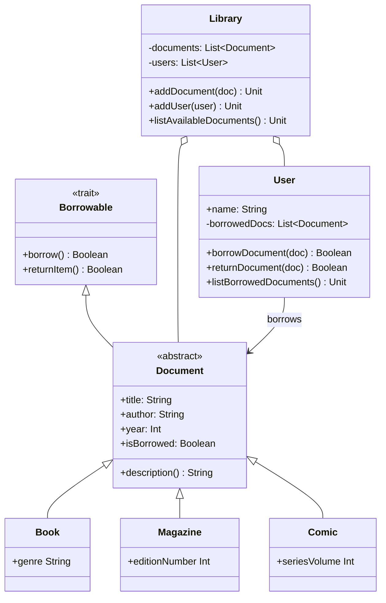

# Scala Library Management

A small library management system written in **Scala 3**, built to practise object-oriented programming.

It manages documents (books, magazines, comics), registers users, and handles borrowing and returning with consistent state.

## Concepts covered

- **Traits**: `Borrowable` defines the borrow/return contract
- **Abstract classes and inheritance**: `Document` → `Book`, `Magazine`, `Comic`
- **Polymorphism**: each document type overrides `description()`
- **Encapsulation**: private state, only modified through dedicated methods
- **Immutable collections**: `List` with `:+`, `filter`, `foreach`

## Class diagram



## Project structure

```
src/main/scala/library/
├── Borrowable.scala   # trait: borrow / return contract
├── Document.scala     # abstract base class with borrowing logic
├── Book.scala         # document with a genre
├── Magazine.scala     # document with an edition number
├── Comic.scala        # document with a series volume
├── User.scala         # library member and their borrowed documents
├── Library.scala      # catalogue of documents and users
└── Main.scala         # simulation of borrows and returns
```

## Run

Requires Java 17+ and [sbt](https://www.scala-sbt.org/).

```bash
sbt run
```

## Sample output

```
--- Borrowing ---
Alice borrows Dune: true
Alice borrows Asterix: true
Bob borrows Dune: false
Bob borrows National Geographic: true

--- Returns ---
Bob returns Dune: false
Alice returns Dune: true
Bob borrows Dune again: true
```

## Design notes

- `isBorrowed` is a `Boolean` (the original spec listed it as `String`).
- `borrow()` and `returnItem()` update the state, so a document cannot be borrowed twice.
- A user can only return a document they actually borrowed.
- `listBorrowedDocuments()` returns `Unit` since it only prints.

## Author

**Nourimane Kerroumi** · [GitHub](https://github.com/Nourimanekerroumi996)